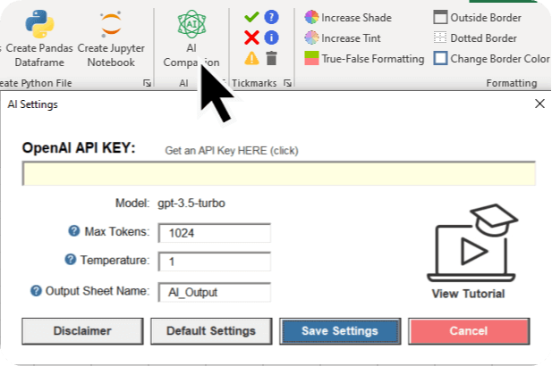
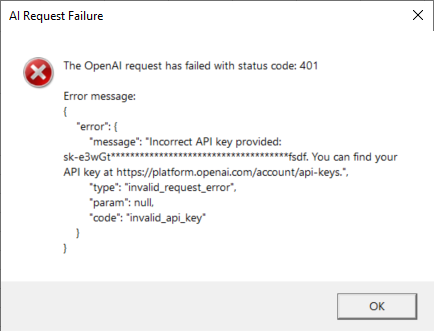
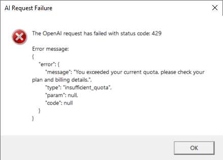

⚠️ **NOTE**: The provided code and the Excel add-in only works on Windows. ⚠️
  
# !!! NEWS !!! AI Companion: GPT-3.5 Turbo inside Excel 🤯🚀
After creating the video, I realized it would be an excellent idea to make this feature more accessible. As a result, I included the AI Companion feature in the free version of the MyToolBelt add-in. The AI Companion leverages the even more powerful GPT-3.5 Turbo model, making it easier than ever to integrate cutting-edge AI technology directly into your spreadsheets.

## 🔥 **Experience the AI Companion now: [MyToolBelt Add-in](https://pythonandvba.com/mytoolbelt)** 🔥

## 🎥 **Sneak peek YouTube video**:

## ChatGPT right INSIDE Excel 🤯
In this repo, you'll find the VBA code from the YouTube video, which demonstrates how to integrate the GPT-3 model into Microsoft Excel using custom VBA code.

### Demo

### Video Tutorial

## Common Issues and Solutions

### I received an error message regarding an OpenAI request failure with a 401 status code, stating that my API key is incorrect. What should I do? 

If you encounter a 401 error message indicating an incorrect API key, please follow these steps:

1. Double-check your OpenAI API key: Make sure you have entered the correct API key in the MyToolBelt add-in settings. You can find your API key by logging into your OpenAI account at https://platform.openai.com/account/api-keys
2. Ensure there are no extra spaces or characters: When copying and pasting your API key, make sure you haven’t accidentally included any extra spaces or characters, as this can cause the key to be recognized as invalid.
3. Verify your OpenAI API plan: Ensure that your OpenAI API plan is active and supports the features you are trying to access with the AI Companion.

### I received an error message regarding an OpenAI request failure with a 429 status code, stating that I exceeded my current quota. I'm using the free credits I received when signing up. What should I do?

If you encounter a 429 error message indicating that you have exceeded your current quota while using the free credits provided upon signing up, please follow these steps:

1. Check your OpenAI API usage: Log into your OpenAI account at https://platform.openai.com/account/api-keys and review your API usage to determine if you have indeed exceeded your allotted quota for the current billing period.
2. Add your billing details: If you have used up your free credits, you will need to add your billing details to your OpenAI account in order to continue using the AI Companion. To do so, visit https://platform.openai.com/billing and enter the required information.

## About Me
- Sven from Coding Is Fun
- YouTube: https://youtube.com/c/CodingIsFun
- Website: https://pythonandvba.com

## Feedback
If you have any feedback, please reach out to me at contact@pythonandvba.com

